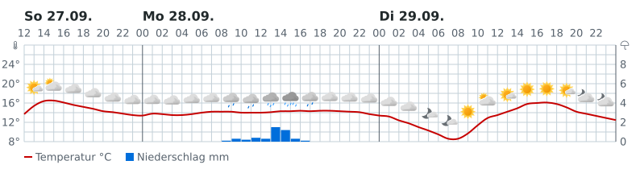
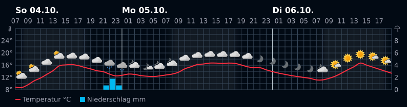

# Wettergraph

A Home Assistant app that draws one place's forecast as a weather graph
(a meteogram) and serves it as an image. It looks like yr.no's own graph:
temperature curve, weather icons, rain bars, and no wind.

The data comes from met.no's open `locationforecast/2.0/compact` API. No API
key, no account, no browser, no headless Chrome. The graph is drawn with
Python and `resvg-py` in about 140 ms.




Both previews are a live Oslo forecast at 794 px, one per theme. They are the
same SVGs a dashboard card reads, so the font is the one your browser has
(nothing is embedded).

## What the image holds

- A 60 h window, starting at the hour of the render.
- A temperature curve (2 px) whose red/blue split sits at 0 °C.
- One 24 px weather icon every 2 h, picked from 83 met.no symbol codes.
- Hourly rain bars on a fixed 0..10 mm/h axis.
- A °C axis on the left, an mm axis on the right, a day separator at every
  local midnight, hour labels every 2 h.
- The night shaded from Home Assistant's `sun.sun` (option `day_night`,
  per request `?daynight=0|1`).
- No wind, no attribution, no "now" marker. Those are left out on purpose.

When met.no has been unreachable for over 6 h the last good graph is served
with an age chip (`vor 7 h`). With no data at all the empty frame is served
with the last error. The app never shows a blank image because the network
blinked.

## Install

Home Assistant OS only. A native (container) install has no app store.

1. Settings -> Add-ons -> Add-on Store -> three-dot menu top right ->
   **Repositories**.
2. Add `https://github.com/macmacs/ha-wettergraph`. The repo root holds
   `repository.yaml`; the app itself is in `wettergraph/`.
3. Reload the store page if needed, then install **Wettergraph**.
4. **Start** it and open the **Log** tab. The startup check runs the real
   routes in-process and prints one `PASS` line per route, then
   `wettergraph: startup check 22/22 passed`. A failing line names what to
   fix. Home Assistant OS gives you no shell inside the container, so this
   check is the self-test.
5. Open the app's status page from the sidebar (it runs behind ingress). It
   shows the image, the URL to paste into a camera, and the age of the data.

No API key goes in. met.no asks for a descriptive User-Agent, and the app
sends its own with the repo URL in it.

## Show it on a dashboard

The dashboard is served over HTTPS and the app's port is HTTP, so a card
cannot load `http://<ha-host>:8099/image/graph` directly. A browser blocks it
as mixed content. Two ways around that:

**Card, same origin (the normal route).** The app writes both themes into
Home Assistant's own `www` folder, which HA serves at `/local/`:

    /homeassistant/www/wettergraph/graph-light.svg  ->  /local/wettergraph/graph-light.svg
    /homeassistant/www/wettergraph/graph-dark.svg   ->  /local/wettergraph/graph-dark.svg

The card is HACS's `custom:refreshable-picture-card`:

```yaml
type: custom:refreshable-picture-card
refresh_interval: 600
url: /local/wettergraph/graph-light.svg
attribute: ''
noMargin: true
tap_action:
  action: more-info
grid_options:
  rows: auto
  columns: 18
```

`rows: auto` lets the SVG scale to its tile. Wrap two of these in a
`conditional` card on `sun.sun` to swap light for dark.

**Generic Camera (server-side fetch).** HA fetches the PNG itself and serves
it from the HA origin, so no card and no HACS are needed. Use it when you want
a `camera.` entity or a **Picture entity** card.

1. Settings -> Devices & services -> **Add integration** -> **Generic
   Camera**.
2. **Still Image URL**: `http://<ha-host>:8099/image/graph?width=794&theme=light`.
   Leave **Stream Source** empty.
3. Keep the advanced section at its defaults. The old `frame_interval` option
   is gone; the **Frame rate** left there only floors repeated fetches of the
   same URL, it does not set the refresh schedule.

Add `&age=1` to that URL to draw the age chip with minutes instead of hours
(`vor 4 min`). The number moves, so a wall dashboard proves by itself that it
is re-reading the image.

**Local file (no port at all).** If HA cannot reach port 8099 (port conflict,
firewall, its own Docker network), the app also writes the same PNG to
`/share/wettergraph/graph.png`. Add a **Local file** camera with that path.
HA core reads the file, so nothing has to be reachable. Its freshness shows on
the status page.

New data lands every 30 to 60 min: the app does not poll before met.no's own
`Expires` header says the model has changed.

## Options

Set under **Configuration**. The last two are defaults only: they decide what
a bare URL serves, while `?width=` and `?theme=` still win per request.

| Option | Default | Meaning |
| --- | --- | --- |
| `page_note` | `setup probe` | Free text on the status page. Proves live option reads. |
| `place_id` | `2-6325496` | met.no/yr place id. |
| `latitude` | `48.1746` | 4 decimals on purpose: met.no caches at that precision. |
| `longitude` | `11.5538` | Same reason. |
| `update_interval` | `15` | Minutes between refreshes, when met.no sends no `Expires`. `Expires` wins. |
| `image_width` | `794` | Width in px, clamped to 560..1588. Height follows the canvas ratio. |
| `image_theme` | `light` | `light` or `dark`. |

The place id is shown on the status page only; the coordinates are what is
fetched. Change both when you move.

## Routes

| Route | What it returns |
| --- | --- |
| `/` | The status page: the image, the option values, the data age, the camera URL. |
| `/image/graph` | The PNG the camera polls. `?width=`, `?theme=`, `?age=1`. |
| `/image/graph.svg` | The same picture as SVG, for debugging. |
| `/forecast.json` | The normalised series: `samples`, `fetched_at`, `age_seconds`, `stale`, `last_error`. |
| `/health` | `ok`. Used as the watchdog. |

`http://<ha-host>:8099/` works when the port is reachable from your browser.
The sidebar panel works over ingress either way.

## The repo

    wettergraph/        the app: config.yaml, Dockerfile, server, renderer, icons
    tools/              the checks and the icon extractor
    docs/               the graph spec, the dark-palette findings, the previews

- `wettergraph/README.md` is the full manual: log lines, camera routes in
  detail, how the image is built, and every local check.
- `docs/graph-spec.md` is the visual spec the renderer is written to, clause
  by clause. The renderer's comments and the checks cite its numbers.
- `docs/dark-palette.md` records where the dark palette comes from.

## Local checks

```sh
uv run --with pyyaml --with voluptuous python tools/addon-lint.py   # the app config
uv run --with resvg-py --with pillow python tools/render-check.py   # the renderer, 91 checks
```

`tools/render-check.py` diffs the renderer's own output against yr's own
meteogram, which is vendored under `tools/assets/` for that reason. It uses no
network: the series are fixtures, so the output is reproducible.
`tools/extract-icons.py` rebuilds the icon set in `wettergraph/app/icons/`
from the vendored meteogram and webp files.
